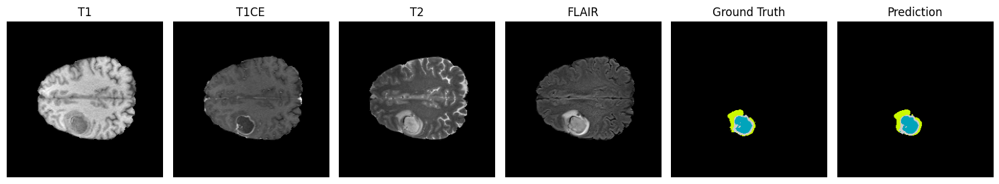

# Brain Tumor Segmentation Using Multi-Modal MRI and U-Net (PyTorch)




## 1. Overview

This project performs **brain tumor segmentation** using a **U-Net architecture implemented in PyTorch**.  
Each MRI slice contains four imaging modalities:

- **T1**
- **T1CE**
- **T2**
- **FLAIR**

These modalities are stacked to form a **4-channel input** of size **240 × 240 × 4**.

The model outputs a **one-hot encoded segmentation mask** of size **240 × 240 × 4**, representing:

- **0 — Background**  
- **1 — Necrotic / Non-Enhancing Tumor (NCR/NET)**  
- **2 — Edema (ED)**  
- **3 — Enhancing Tumor (ET)**  

From the trained model, we can generate segmented images that identify and highlight tumor regions.

---

## 2. Setup Instructions

Follow these steps to configure the environment and run the project.

---

### **Step 1 — Create and activate a virtual environment**

```bash
conda create -n pytorch-gpu python=3.10 -y
conda activate pytorch-gpu

```

### **Step 2 — Install PyTorch**
#### For CUDA GPU supported machine
```bash
pip install torch torchvision torchaudio --index-url https://download.pytorch.org/whl/cu121
```
#### For CPU-only machine
```bash
pip install torch torchvision torchaudio
```

### **Step 3 — Install required dependencies**
```bash
pip install numpy nibabel opencv-python scikit-learn matplotlib tqdm
```

---

## 3. Running the project
Open the project .ipynb file and run it.
